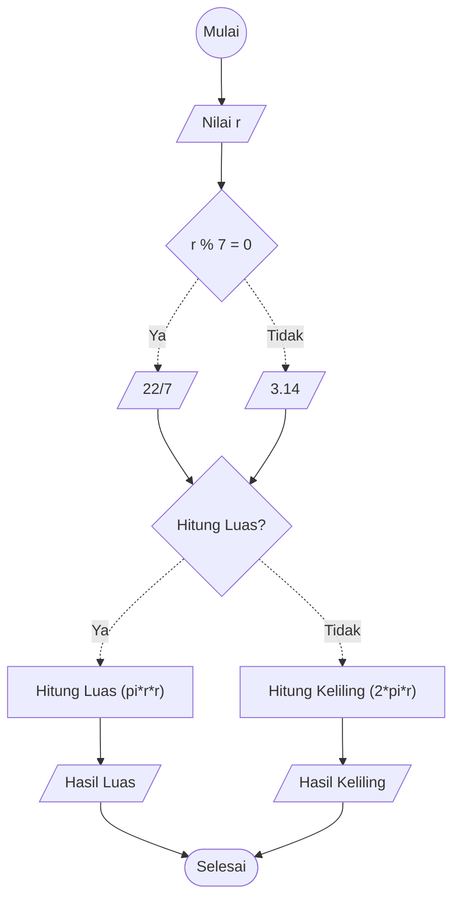

Menghitung luas dan keliling Lingkaran

1. Mulai
2. Masukkan nilai jari-jari
3. Jika nilai jari-jari bisa dibagi 7, maka isi nilai pi dengan 22/7
4. Jika nilai jari-jari tidak bisa dibagi 7, maka isi nilai pi dengan 3.14
5. Hitung luas lingkaran dengan cara pi dikalikan nilai jari-jari dikalikan nilai jari-jari
6. Tampilkan hasil hitung luas
7. Hitung keliling lingkaran dengan cara pi dikalikan 2 dikalikan nilai jari-jari
8. Tampilkan hasil hitung lingkaran
9. Selesai

# Flowchart

## Menghitung luas & keliling lingkaran



## Pseudo-Code
```
DECLARE R : REAL
DECLARE Pi : REAL
DECLARE HitungLuas : BOOLEAN
DECLARE HasilHitungLuas : REAL
DECLARE HasilHitungKeliling : REAL
INPUT R
IF R % 7 = 0 THEN
  Pi <- 22/7
ELSE
  Pi <- 3.14
ENDIF
INPUT HitungLuas
IF HitungLuas = true THEN
  HasilHitungLuas <- Pi * R * R
  Output "Luas Lingkaran = ", HasilHitungLuas
ELSE
  HasilHitungKeliling <- 2 * Pi * R
  Output "Keliling Lingkaran = ", HasilHitungKeliling
ENDIF