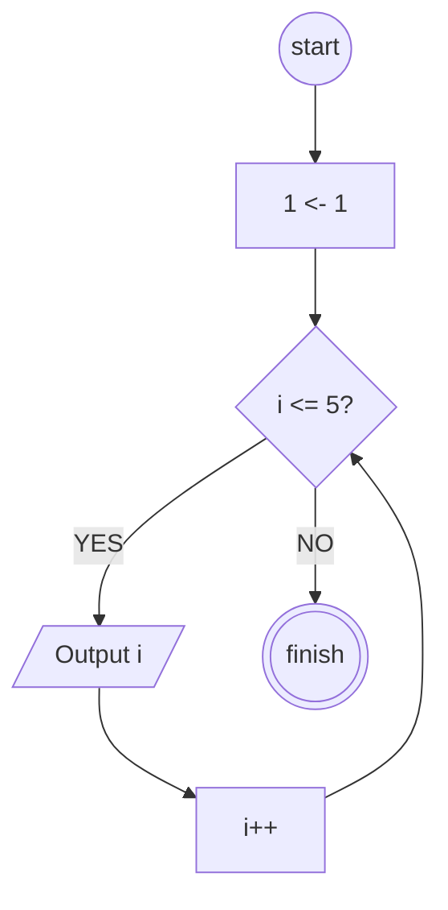

# Algoritma Perhitungan

## Flowchart

```mermaid
flowchart TD
start((start))
init["1 <- 1"]
check{"i <= 5?"}
output[/Output i/]
increment["i++"]
finish(((finish)))
start --> init
init --> check
check -- YES --> output
output --> increment
increment --> check
check -- NO  --> finish
```

## Pseudo-Code
FOR i <- 1 TO 5
  Output i
NEXT i